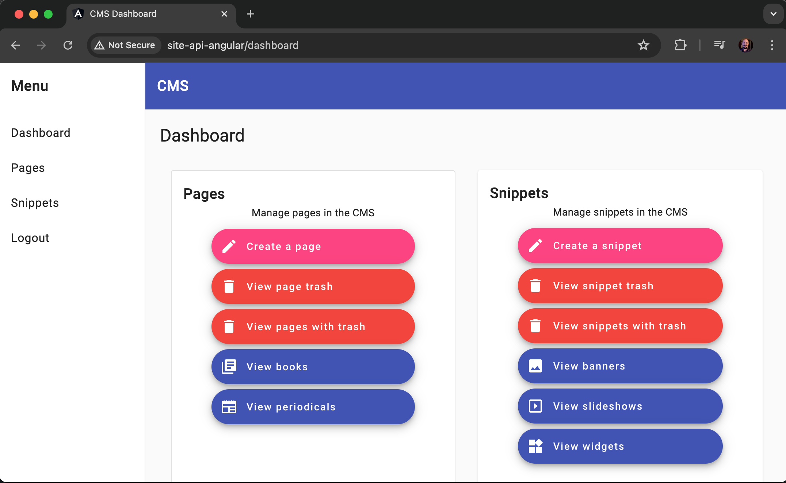
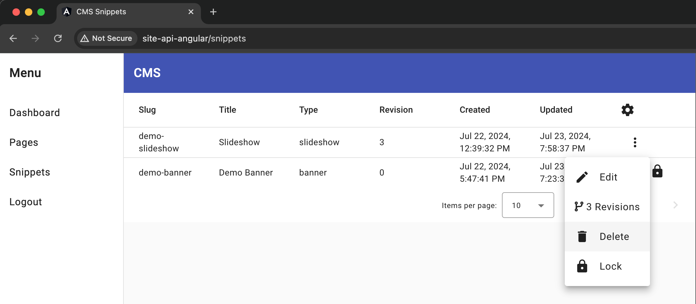
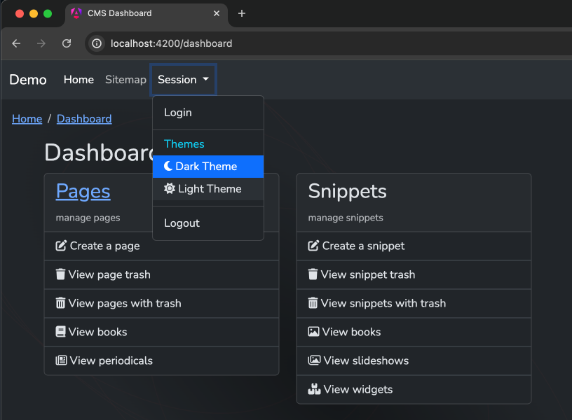

# Site: Playground API and Angular SPA Integration

[](https://raw.githubusercontent.com/gammamatrix/site-api-angular/testing/develop/testdox.txt)
[](tests)
[](.github/workflows/ci.yml#L133)


Site: Playground API and Angular SPA Integration Package for [Laravel v11](https://laravel.com/docs/11.x) and [Angular v16, v17, v18](https://angular.dev/) applications.

Read more on using [Site: Playground API and Angular SPA Integration at Read the Docs: Playground Documentation.](https://gammamatrix-playground.readthedocs.io/en/develop/)

## Angular Application

Currently, there is only one Angular Application.

### Site: Playground CMS UI with Angular

Currently, there are two Angular applications available to use with this base Laravel application.

#### CMS with Angular v16 and Angular Material

See:  [gammamatrix/site-playground-cms-angular](https://github.com/gammamatrix/site-playground-cms-angular)





#### CMS with Angular v18 and Bootstrap v5

See: [gammamatrix/site-playground-cms-angular-bootstrap](https://github.com/gammamatrix/site-playground-cms-angular-bootstrap)



<section>

<details>
<summary>Toggle User Information</summary>

## Users

By default, this application uses a user with a UUID for a primary key: [app/Models/PlaygroundUser.php](app/Models/PlaygroundUser.php).
- auto-incrementing is also supported with the standard [app/Models/User.phps](app/Models/User.phps), which has been renamed as a source file.

</details>

</section>

<section>

<details>
<summary>Toggle Testing and Development Information</summary>

## Testing and Development

### Users

[Playground Test](https://github.com/gammamatrix/playground-test) provides a [custom user table seeder: CustomUsersTableSeeder](https://github.com/gammamatrix/playground-test/blob/develop/resources/CustomUsersTableSeeder.php) for development.
- There is also a [DatabaseSeeder](https://github.com/gammamatrix/playground-test/blob/develop/resources/DatabaseSeeder.php) class that will import `Custom*Seeders` used in this application: [database/seeders/DatabaseSeeder.php](database/seeders/DatabaseSeeder.php).

The user model is set up in [config/auth.php](config/auth.php#L65):

```php
'providers' => [
    'users' => [
        'driver' => 'eloquent',
        'model' => env('AUTH_MODEL', App\Models\PlaygroundUser::class),
    ],
],
```

#### Setting up users for testing

For security reasons, the CustomUsersTableSeeder must be manually linked or copied to this application:

```sh
cd database/seeders
```

```sh
ln -snf ../../vendor/gammamatrix/playground-test/resources/CustomUsersTableSeeder.php
```

</details>

</section>

<section>

<details>
<summary>Toggle Dev Notes</summary>

## Dev Notes

A base Laravel installation was used.

```sh
composer create-project laravel/laravel site-api-angular
```

### Enabled Sanctum

Added `Laravel\Sanctum\HasApiTokens` to the [User](app/Models/User.php) model.

```sh
php artisan install:api
php artisan config:publish cors
```

```conf
SESSION_DOMAIN=site-api-angular
# SESSION_DOMAIN=site-playground-integration
SESSION_HTTP_ONLY=false
SESSION_SECURE_COOKIE=false

SANCTUM_STATEFUL_DOMAINS=site-api-angular
```

```sh
composer require gammamatrix/playground-cms-api
```
- composer.json need to allow `"minimum-stability": "dev",`

## nginx configuration for the PHP API and Angular app

[resources/configuration/31010-site-api-angular.conf](resources/configuration/31010-site-api-angular.conf)
- Note development is done on http with scheme-less URLs, where possible.

</details>

</section>
